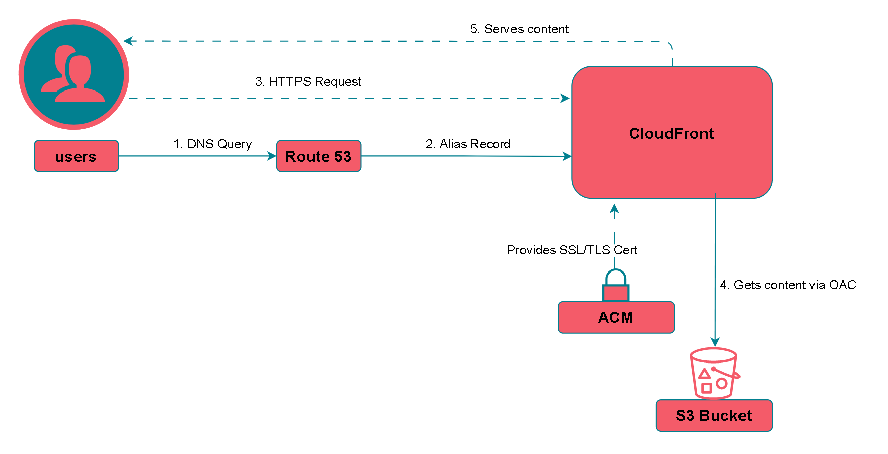

# Cloud-Native Full-Stack Portfolio Website

This repository contains the Infrastructure as Code (IaC) for my personal portfolio website, a full-stack, cloud-native application built entirely on AWS and automated with Terraform and GitHub Actions.

## Demo

You can view the live, deployed website here: **[https://www.aravindakrishnan.click](https://www.aravindakrishnan.click)**

---

## Architecture

The infrastructure is designed to be serverless, secure, scalable, and fully automated. The frontend is decoupled from the backend, with each having its own CI/CD pipeline for independent deployment.



The application flow consists of two main parts:

1.  **Frontend Delivery:** A user requests the domain, which is resolved by **Route 53**. The request is directed to **CloudFront**, which serves the static HTML/CSS/JS content securely from a private **S3 bucket** using Origin Access Control (OAC).
2.  **Backend API (Visitor Counter):** The JavaScript on the frontend makes a call to an endpoint managed by **API Gateway**. This triggers a **Lambda** function (Python), which interacts with a **DynamoDB** table to read and update the unique visitor count, returning the value to the frontend.

---

## Tech Stack & Features

This project leverages a modern, cloud-native stack:

#### **Frontend**
*   **Static Content Hosting:** Amazon S3
*   **Content Delivery Network (CDN):** Amazon CloudFront
*   **DNS & Domain Management:** Amazon Route 53
*   **SSL/TLS Certificates:** AWS Certificate Manager (ACM)

#### **Backend (Serverless API)**
*   **API Endpoint:** Amazon API Gateway (REST API)
*   **Compute:** AWS Lambda (Python runtime)
*   **Database:** Amazon DynamoDB (NoSQL)

#### **DevOps & Automation**
*   **Infrastructure as Code:** Terraform
*   **CI/CD:** GitHub Actions
*   **Security Scanning:** `tfsec` for static analysis of Terraform code.
*   **Secure Authentication:** OpenID Connect (OIDC) for passwordless authentication between GitHub Actions and AWS IAM.

---

## Key Features

*   **Infrastructure as Code:** The entire infrastructure for both frontend and backend is defined declaratively using Terraform, enabling repeatable and consistent deployments.
*   **Dual CI/CD Pipelines:**
    *   Separate GitHub Actions workflows for the frontend and backend, triggered on pushes to the `main` branch.
    *   Workflows are filtered by paths, so only relevant infrastructure is deployed when a change is made.
    *   The backend pipeline runs unit tests and a `tfsec` security scan before every deployment.
*   **Serverless Architecture:** The project is 100% serverless, meaning no servers to manage, automatic scaling, and a pay-for-what-you-use cost model that is highly efficient.
*   **Security-First Design:**
    *   The S3 bucket is private, accessible only by CloudFront via **Origin Access Control (OAC)**.
    *   The GitHub Actions pipelines use secure, short-lived credentials via **OIDC** instead of storing long-lived access keys.
    *   Automated **`tfsec` scanning** in the CI/CD pipeline prevents insecure infrastructure from being deployed.

---

## Local Development & Deployment

While deployment is fully automated, the infrastructure can be managed from a local machine with the appropriate credentials.

1.  **Prerequisites:**
    *   An AWS account
    *   Terraform CLI installed
    *   AWS CLI installed and configured with appropriate permissions (ideally via IAM Identity Center/SSO).

2.  **Clone the repository:**
    ```bash
    git clone https://github.com/arkhiVd/portfolio-project.git
    cd portfolio-project
    ```

3.  **Deploying a specific environment (e.g., backend):**
    ```bash
    cd backend
    terraform init
    terraform plan
    terraform apply
    ```
---

## Future Improvements
*   **Ephemeral Preview Environments:** Implement a separate GitHub Actions workflow that deploys a temporary, complete copy of the application for every Pull Request and runs `terraform destroy` on merge/close.
*   **End-to-End Testing:** Add a testing framework like Cypress or Playwright to the frontend pipeline to run automated browser tests against the live application after deployment.
